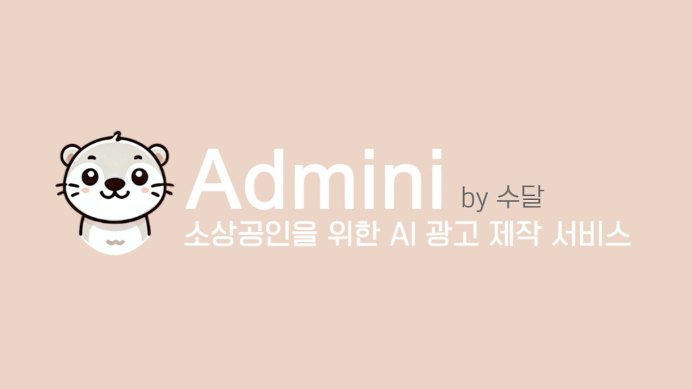
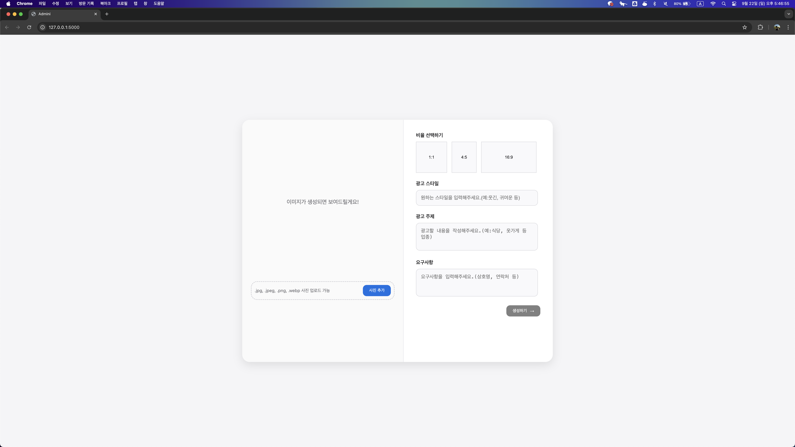

# 수달 - Admini:소상공인을 위한 AI 광고 제작 서비스

## 서비스 요약
Admini는 대구 지역 소상공인들이 온라인 마케팅을 손쉽게 시작할 수 있도록 돕는 AI 광고 제작 서비스입니다. 
이미지와 텍스트를 업로드한 후, 원하는 광고 스타일을 선택하면 AI가 자동으로 광고를 생성합니다. 전문적인 디자인이나 마케팅 지식이 없어도 손쉽게 사용할 수 있어, 소상공인들이 디지털 마케팅에서 성공할 수 있는 기회를 제공합니다. 이를 통해 대구 지역 상권의 활성화를 지원하고, 소상공인들이 경쟁력 있는 마케팅 전략을 구축할 수 있도록 돕고자 합니다.

## 주제 구분
-	C타입 대구 지역 상권을 살리는데 도움을 주는 서비스 

## 팀원 소개
팀명: 수달
팀원 :
- 강민정 : 기획, 프론트엔드
- 박석현 : 백엔드, AI
- 박지은 : 백엔드, AI
- 위혜정 : 백엔드, 이미지 처리

## 시연 영상 : Youtube

## 배포 주소
- 서비스 운영 기간 : 2024.09.22.일 18:00 ~ 2024.09.25.수 23:59
- 배포 주소 : [Admini](https://a887-14-45-87-156.ngrok-free.app)
- 접속 불가 시 최신 배포 주소 업데이트 : [Notion](https://www.notion.so/Admini-10979274622f80ba899cfeca1f1a8d2c?pvs=4)

## 서비스 소개
### 서비스 개요
Admini는 대구 지역 소상공인들이 온라인 마케팅을 손쉽게 시작할 수 있도록 돕는 AI 광고 제작 서비스입니다. 현재 대다수의 소상공인은 40대 이상의 연령층으로, 온라인 마케팅 도구에 익숙하지 않은 경우가 많습니다. 그러나 효과적인 마케팅은 온라인을 통해 이루어지는 시대적 변화에 맞춰, Admini는 소상공인들이 간단하게 광고를 제작할 수 있는 방법을 제공합니다.

이미지와 텍스트를 업로드한 후, 원하는 광고 스타일을 선택하면 AI가 자동으로 광고를 생성합니다. 전문적인 디자인이나 마케팅 지식이 없어도 손쉽게 사용할 수 있어, 소상공인들이 디지털 마케팅에서 성공할 수 있는 기회를 제공합니다. 이를 통해 대구 지역 상권의 활성화를 지원하고, 소상공인들이 경쟁력 있는 마케팅 전략을 구축할 수 있도록 돕습니다.

### 타서비스와의 차별점
- 사용의 간편함: 소상공인들이 스마트폰이나 컴퓨터에 익숙하지 않아도 손쉽게 광고를 제작할 수 있도록 UI/UX를 단순화하였고, 별도의 어플 다운로드 없이 웹페이지 접속으로 가능하게 했습니다. 
- AI 기반 자동화: Admini의 핵심 기능은 AI가 이미지와 텍스트를 기반으로 자동 광고를 생성하는 것입니다. 이를 통해 소상공인들은 시간과 노력을 절약할 수 있으며, 별도의 디자인 기술이나 마케팅 경험이 없어도 효율적인 광고 제작이 가능합니다. 이 자동화된 과정은 소상공인들이 빠르게 디지털 마케팅을 시작하고 운영할 수 있는 경쟁력을 제공합니다.
- 저렴한 비용: 소상공인들이 고가의 광고 대행사를 통하지 않고도 저렴한 비용으로 디지털 마케팅을 실행할 수 있어, 경제적으로 부담이 적습니다.

### 구현 내용 및 결과물
1. 사진 업로드
  - 사용자가 광고를 제작하는데 사용할 이미지를 업로드 합니다. 
  - 이미지 업로드 취소, 재업로드 및 변경이 가능합니다. 
2. 비율 선택
  - 사용자가 원하는 광고 결과물의 비율을 선택합니다. 
3. 광고 스타일, 주제, 요구사항 입력
  - 사용자가 원하는 광고 스타일, 주제, 요구사항을 입력합니다. 
4. 광고 생성하기
  - 생성하기 버튼을 누르면 AI 광고 이미지가 생성됩니다.

### 구현 방식

##### Frontend:
  

##### Backend:
 

##### Ai:

##### 배포

## 향후 개선 혹은 발전 방안
- 비율 선택 옵션 구현: 현재 Admini에 비율 선택이 가능하지만 기능 구현은 되어있지 않습니다. 향후 사용자가 원하는 광고물의 비율을 직접 선택할 수 있는 기능을 추가할 계획입니다. 이를 통해 다양한 플랫폼에서 사용 가능한 광고물을 제작할 수 있으며, 인스타그램, 페이스북, 유튜브 등 각 플랫폼의 요구에 맞는 맞춤형 광고 제작이 가능해집니다.

- 광고 영상 제작 기능 지원: 텍스트와 이미지 기반의 광고 제작 기능에서 나아가, 동영상 광고 제작 기능을 추가할 예정입니다. 이는 사용자들이 더욱 역동적이고 시각적인 콘텐츠를 제작할 수 있도록 돕고, 영상 광고를 선호하는 현대 마케팅 트렌드를 반영해 소상공인들이 다양한 미디어 형식을 활용할 수 있도록 지원할 것입니다.

- 음성 명령 광고 제작 기능 지원: 앞으로는 음성 명령을 통해 광고 제작이 가능한 기능도 도입할 계획입니다. 사용자가 음성으로 원하는 텍스트나 광고 스타일을 지정하면, AI가 이를 바탕으로 광고를 자동으로 생성하는 방식입니다. 특히, 디지털 기기 사용에 익숙하지 않은 사용자들에게 더욱 직관적이고 편리한 환경을 제공할 수 있을 것입니다.
